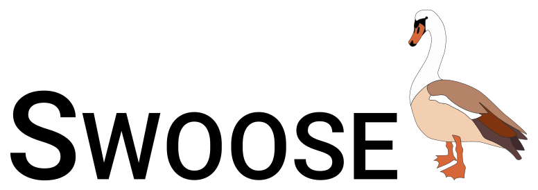

SCINE - Swoose
=================

.. inclusion-marker-do-not-remove

Introduction
------------

This repository contains the Swoose module of
the SCINE open-source quantum chemistry software.
It provides functionalities for treating large molecular
systems with self-parametrizing system-focused atomistic models.
This includes the automated parametrization of such models and
applying them in single point calculations as well as structure
optimizations or molecular dynamics simulations. Furthermore, this
module also provides QM/MM hybrid models.

License and Copyright Information
---------------------------------

This code is licensed under the 3-clause BSD license.
Copyright ETH Zurich, Department of Chemistry and Applied Biosciences, Reiher Group.
See LICENSE.txt for details.

Installation and Usage
----------------------

For instructions on how to install and use Swoose as well as for a detailed
documentation of the entire functionality of Swoose, please consult the user
manual found in the ``manual`` directory in the repository.
Alternatively the manual can also be found on the official GitHub website and
on the SCINE website.

How to Cite
-----------

When publishing results obtained with Puffin, please cite the corresponding
release as archived on `Zenodo <https://doi.org/10.5281/zenodo.5782876>`_
(please use the DOI of the respective release).

In addition, we kindly request you to cite the following articles when using
the corresponding parts of Swoose:

C. Brunken, M. Reiher, "Self-Parametrizing System-Focused Atomistic Models",
*J. Chem. Theory Comput.*, **2020**, *16*, 1646-1665.

C. Brunken, M. Reiher, "Automated Construction of Quantum-Classical Hybrid Models",
*J. Chem. Theory Comput.*, **2021**, *17*, 3797-3813.

K.-S. Csizi, M. Reiher, "Automated preparation of nanoscopic structures: Graph-based
sequence analysis, mismatch detection, and pH-consistent protonation with uncertainty estimates"
*J. Comput. Chem*, **2024**, *45*, 761-776.

K.-S. Csizi, M. Steiner, M. Reiher, "Quantum Magnifying Glass for Chemistry at the Nanoscale",
*chemRxiv", **2023**, DOI 10.26434/chemrxiv-2023-t10sc.

Support and Contact
-------------------

In case you should encounter problems or bugs, please write a short message
to scine@phys.chem.ethz.ch.

Third-Party Libraries Used
--------------------------

SCINE Swoose makes use of the following third-party libraries:

- `Boost <https://www.boost.org/>`_
- `Cereal <https://uscilab.github.io/cereal/>`_
- `Eigen <http://eigen.tuxfamily.org>`_
- `Google Test <https://github.com/google/googletest>`_
- `MongoDB C++ Driver <http://mongocxx.org/>`_
- `pybind11 <https://github.com/pybind/pybind11>`_
- `yaml-cpp <https://github.com/jbeder/yaml-cpp>`_
